# Evidencia Final Compiladores
#### Equipo 7
**Emiliano Cabrera Ruiz**: A01025453
 **Do Hyun Nam**: A01025276
 **Valter Alejandro Kuhne Hernández**: A01379392

## Gramática
**Rule 0** |     S' -> assignment
 **Rule 1** |    assignment -> VARIABLE SETTO expression
 **Rule 2** |    assignment -> VARIABLE SETTO flow
 **Rule 3** |    flow -> VARIABLE CONNECT flow_functions
 **Rule 4** |    flow_functions -> flow_function_call CONNECT flow_functions
 **Rule 5** |    flow_functions -> flow_function_call
 **Rule 6** |    flow_function_call -> VARIABLE LPAREN RPAREN
 **Rule 7** |    assignment -> expression
 **Rule 8** |    expression -> expression PLUS term
 **Rule 9** |    expression -> expression MINUS term
 **Rule 10** |   expression -> term
 **Rule 11** |   expression -> string
 **Rule 12** |   string -> STRING
 **Rule 13** |   term -> term TIMES exponent
 **Rule 14** |   term -> term DIVIDE exponent
 **Rule 15** |   term -> exponent
 **Rule 16** |   exponent -> factor EXP factor
 **Rule 17** |   exponent -> factor
 **Rule 18** |   exponent -> LPAREN expression RPAREN
 **Rule 19** |   factor -> NUMBER
 **Rule 20** |   factor -> VARIABLE
 **Rule 21** |   factor -> function_call
 **Rule 22** |   function_call -> VARIABLE LPAREN RPAREN
 **Rule 23** |   function_call -> VARIABLE LPAREN params RPAREN
 **Rule 24** |   params -> params COMMA expression
 **Rule 25** |   params -> expression
 **Rule 26** |   function_call -> WATERSHED LPAREN VARIABLE RPAREN
 **Rule 27** |   function_call -> GRABCUT LPAREN VARIABLE RPAREN
 **Rule 28** |   function_call -> TEMPLATEMATCHING LPAREN VARIABLE COMMA VARIABLE RPAREN
 **Rule 29** |   function_call -> CANNYEDGEDETECTION LPAREN VARIABLE RPAREN
 **Rule 30** |   expression -> list
 **Rule 31** |   list -> LSQUARE list_items RSQUARE
 **Rule 32** |   list_items -> list_items COMMA NUMBER
 **Rule 33** |   list_items -> NUMBER
 **Rule 34** |   expression -> expression LSQUARE NUMBER RSQUARE
 **Rule 35** |   expression -> expression LSQUARE NUMBER RSQUARE SETTO expression

## Funciones Implementadas
CANNYEDGEDETECTION: función de OpenCV
 COMMA: caracter ','
 CONNECT: expresión regular que busca '->'
 DIVIDE: expresión regular que busca '/'
 EXP: expresión regular que busca '^'
 GRABCUT: función de OpenCV
 LPAREN: expresión regular que busca '('
 LSQUARE: expresión regular que busca '['
 MINUS: expresión regular que busca '-'
 NUMBER: expresión regular que busca cualquier número y lo vuelve entero o decimal 
 PLUS: expresión regular que busca '+'
 RPAREN: expresión regular que busca ')'
 RSQUARE: expresión regular que busca ']'
 SETTO: expresión regular que busca '='
 STRING: expresión regular que busca cualquier string que se encuentre entre comillas dobles '"'
 TEMPLATEMATCHING: función de OpenCV
 TIMES: expresión regular que busca '*'
 VARIABLE: expresión regular que busca cualquier string que no empiece con números y no tenga comillas dobles
 WATERSHED: función de OpenCV

## Expresiones de Prueba
#### Operadores
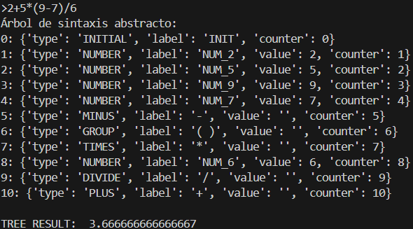
#### Funciones
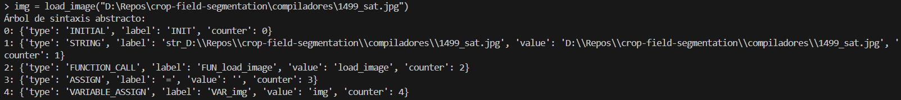
#### Variables
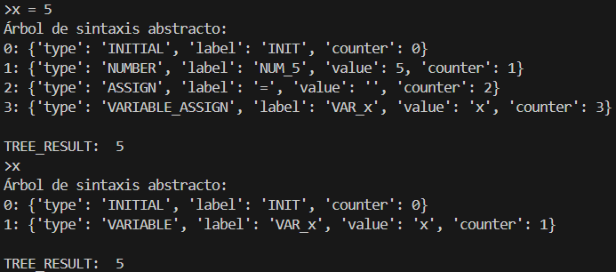
#### Flujos de imagenes
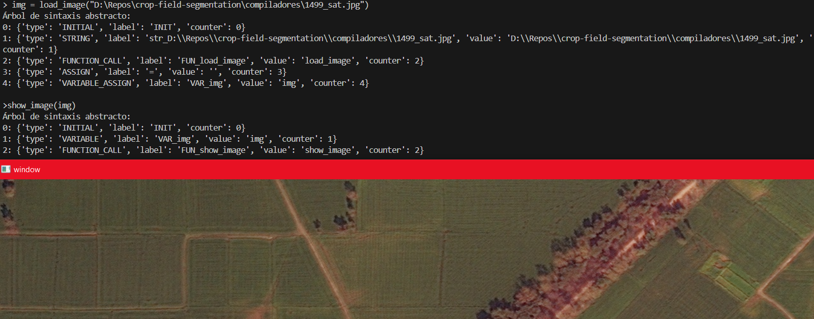
#### Filtros OpenCV
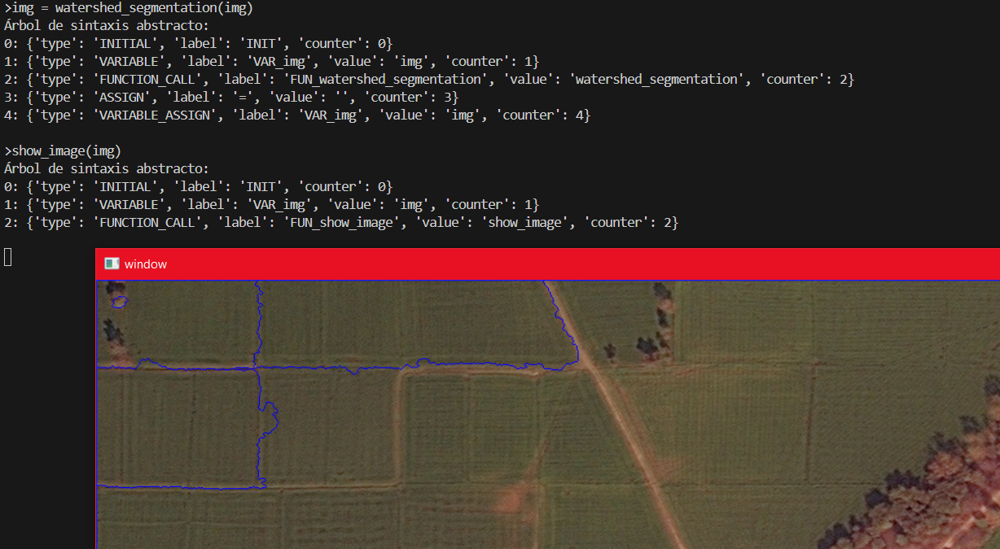
#### Nuevas características
##### Archivos
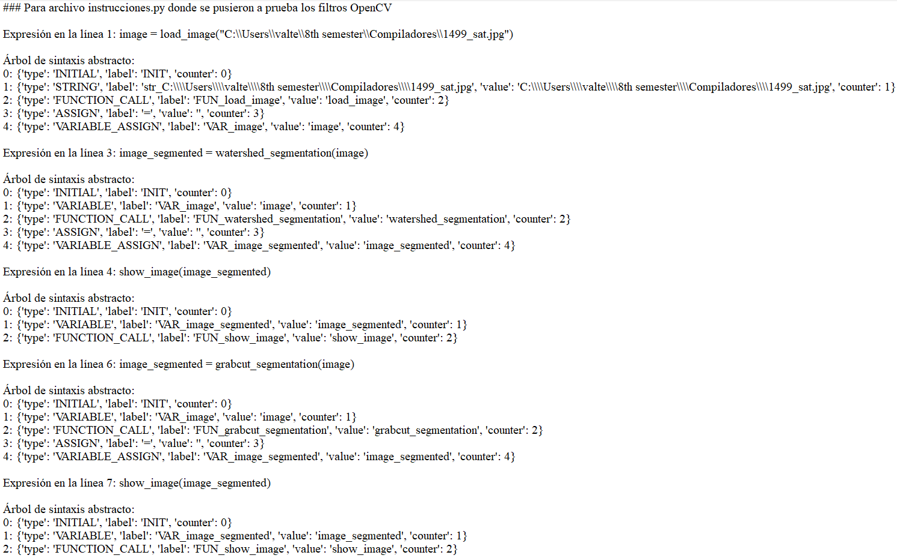 
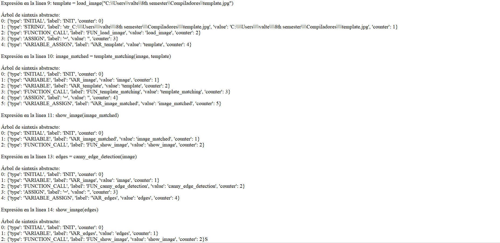
##### Matrices y numpy
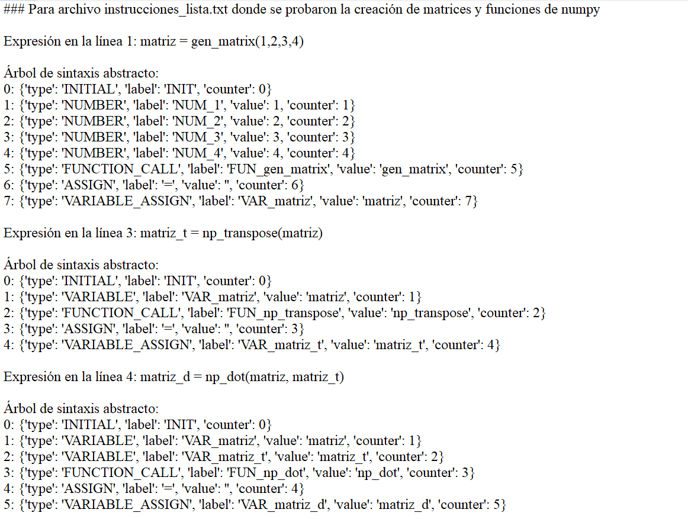
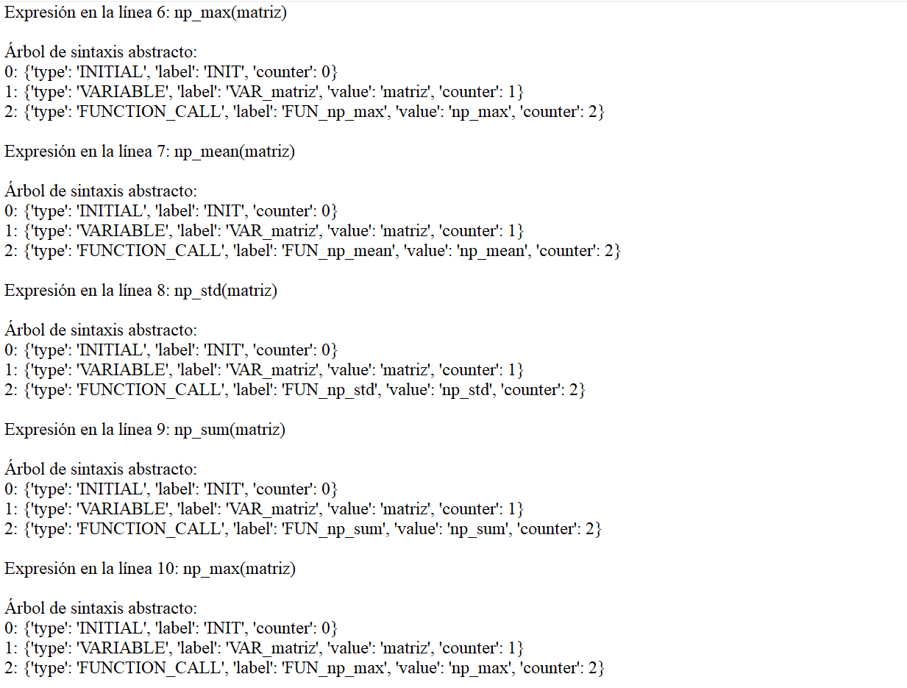
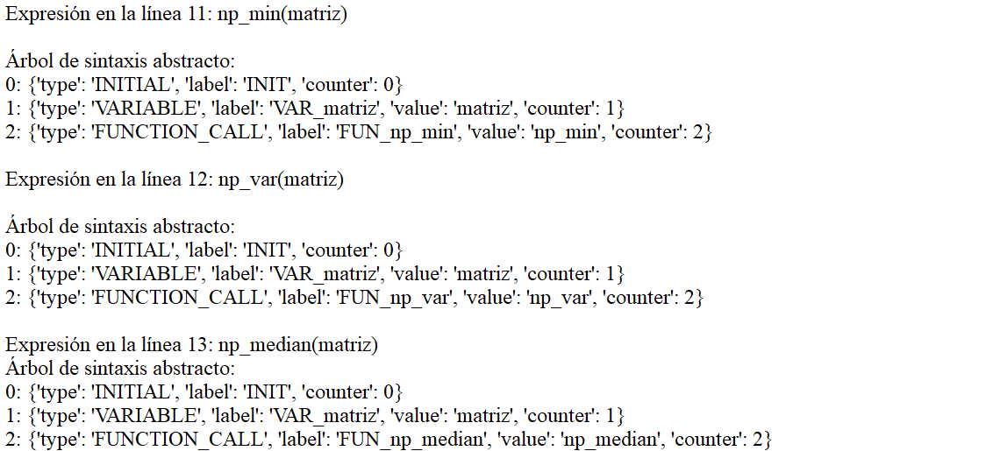
##### Histogramas
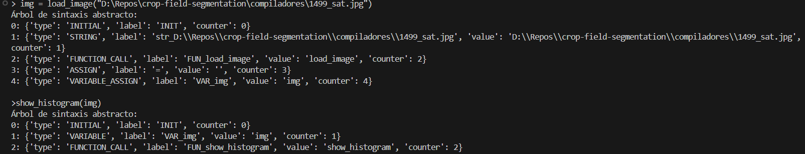
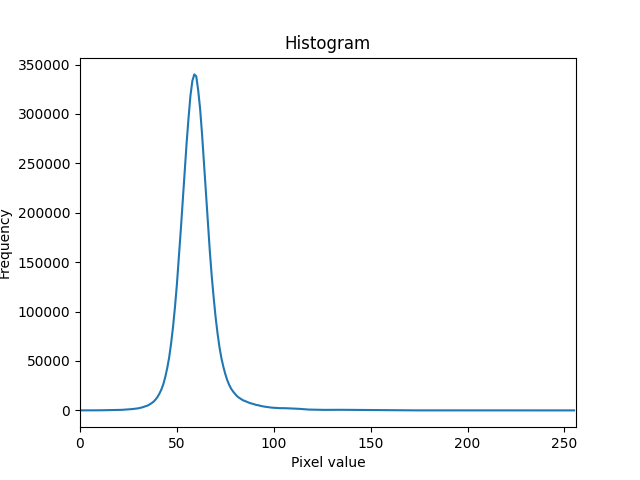
##### Pruebas automáticas

## Videos
[Emiliano Cabrera Ruiz]()
 [Do Hyun Nam]()
 [Valter Alejandro Kuhne Hernández]()

## Referencias
